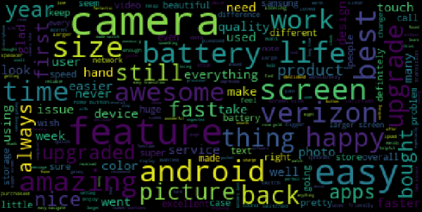
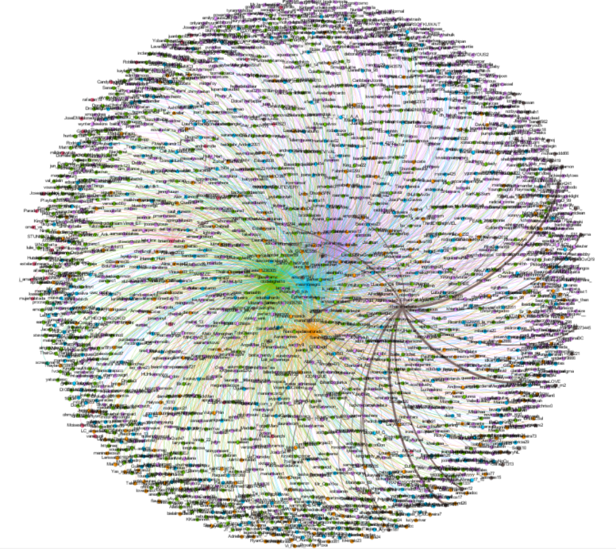

# 📱 iPhone Social Media & Sentiment Analytics

> Twitter Analytics, Text Analytics, Sentiment Analysis, Topic Modeling, and Network Analysis of iPhone-related social media discussions and customer reviews.

---

## 📖 Overview

This project analyzes social media discussions and customer reviews related to Apple iPhones using a combination of text analytics, sentiment analysis, topic modeling, and network analysis techniques.

The goal was to identify common themes, measure customer sentiment, and uncover patterns in user conversations surrounding iPhone products.

---

## 🎯 Objectives

* Collect and analyze iPhone-related social media data
* Perform text preprocessing and cleaning
* Measure sentiment within tweets and reviews
* Identify frequently discussed topics
* Explore relationships between users and conversations
* Visualize insights using charts and network graphs

---

## 🛠️ Technologies Used

* Python
* Pandas
* NumPy
* Matplotlib
* JSON
* Requests
* Natural Language Processing (NLP)
* Sentiment Analysis
* Topic Modeling
* Network Analysis

---

## 🔍 Project Components

### 🧹 Text Analytics

Processed and cleaned raw social media text data to prepare it for analysis.

### 😊 Sentiment Analysis

Evaluated positive, negative, and neutral sentiment expressed in tweets and customer reviews.

### 🧠 Topic Modeling

Identified recurring themes and discussion topics within iPhone-related conversations.

### 🕸️ Network Analysis

Examined relationships between users and interactions to better understand communication patterns.

### 📊 Data Visualization

Created visual representations of trends, sentiment distributions, and analytical findings.

---

## 📈 Key Skills Demonstrated

* Data Cleaning and Preparation
* Exploratory Data Analysis (EDA)
* Natural Language Processing
* Sentiment Analysis
* Data Visualization
* Social Media Analytics
* Python Programming
* Business Insight Generation

---

## 🏆 Results

The project demonstrated how text analytics and machine learning techniques can be applied to large collections of social media and customer review data to uncover:

* Customer sentiment trends
* Frequently discussed topics
* User interaction patterns
* Actionable business insights

---

## 📂 Repository Contents

```text
├── README.md
├── iPhone Social Media & Sentiment Analytics.ipynb
└── images/
    ├── sentiment-analysis.png
    ├── topic-modeling.png
    └── network-analysis.png
```

---

## 📸 Example Visualizations

### Sentiment Analysis



### Topic Modeling


### Network Analysis



---

## 👨‍💻 Authors

* Brian Kassin
* Ben Gust

---

## 🎓 Academic Disclaimer

This project was completed as part of an academic analytics course and is presented for educational and portfolio purposes.
